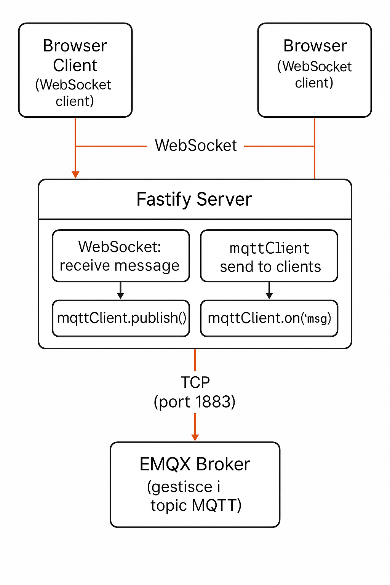

# Exploring MQTT

## Overview

**Exploring MQTT** is a hands-on project aimed at understanding and experimenting with the MQTT protocol — a lightweight messaging protocol commonly used in IoT applications. This project demonstrates how to publish and subscribe to MQTT topics, manage messages, and interact with an MQTT broker using Node.js and TypeScript.

Whether you're new to MQTT or looking to deepen your knowledge, this repository offers practical examples and a clean architecture to get you started.

---

## Technologies Used

- **MQTT** - Lightweight publish/subscribe messaging protocol.
- **Node.js** - JavaScript runtime environment.
- **TypeScript** - Typed superset of JavaScript for scalable code.
- **Docker & Docker Compose** - Containerization and orchestration tools for easy environment setup.

---

## Getting Started

### Prerequisites

Make sure you have the following installed on your machine:

- [Docker](https://www.docker.com/products/docker-desktop)
- [Docker Compose](https://docs.docker.com/compose/install/)
- [Node.js](https://nodejs.org/en/) (v16+ recommended)
- [npm](https://www.npmjs.com/)

### Installation and Running

1. **Clone the repository**

   ```bash
   git clone https://github.com/matteo-brandolino/exploring-mqtt.git
   cd exploring-mqtt
   ```

2. **Start the MQTT broker and related services**

   ```bash
   docker compose up -d
   ```

   The project includes a Docker Compose file to spin up the MQTT broker and any dependent services.

3. **Interact with the application**

   The frontend is accessible at http://localhost:8080 and
   the Fastify server runs on http://localhost:3000

   Use the client code to publish and subscribe to MQTT topics, or extend it with your own MQTT clients.

### Project Architecture


